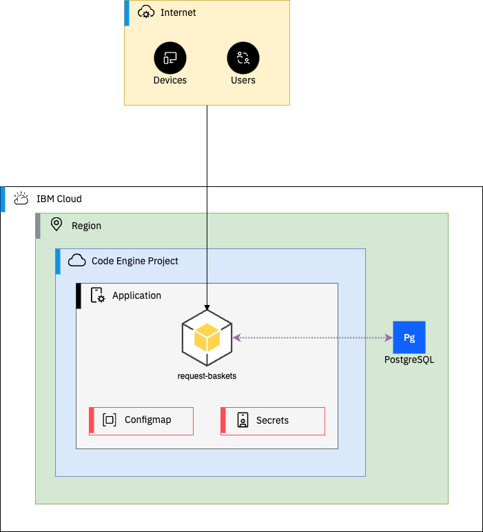

# Overview

Terraform code to deploy an instance of the request-baskets app on IBM Cloud Code Engine with Postgres for persistent storage.

## Prerequisites

- Terrafom installed on your machine
- IBM Cloud API Key

## Usage

1. Clone the repository
2. Set variables 
3. Initialize the directory 
4. Run plan and apply to deploy the resources

